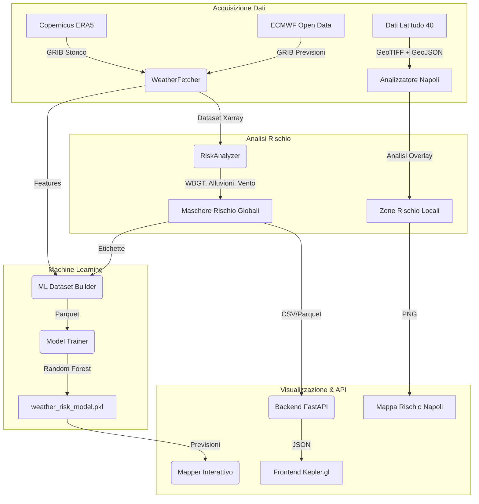

# Sistema di Previsione e Analisi del Rischio Meteorologico

Una pipeline completa basata sull'AI per identificare, prevedere e visualizzare eventi critici e rischi meteorologici utilizzando:
- **Dati Meteorologici**: ECMWF Open Data (previsioni) e Copernicus ERA5 (rianalisi storica)
- **Dati Geospaziali**: Immagini satellitari ad alta risoluzione e dati di analisi urbana forniti da **Latitudo 40**

Questo sistema combina l'intelligenza meteorologica globale con insight geospaziali iper-locali per Napoli, Italia.

---

## 📊 Fonti Dati

### 1. Dati Meteorologici (Globali)
- **ECMWF Open Data**: Previsioni meteorologiche in tempo reale (Vento, Temperatura, Precipitazioni, Punto di rugiada)
- **Copernicus CDS (ERA5)**: Dati di rianalisi storica per l'addestramento dei modelli ML

### 2. Dati Geospaziali (Napoli - Forniti da Latitudo 40)

#### 📦 Struttura dei Dati

I dati sono estratti da **due archivi ZIP forniti da Latitudo 40** e organizzati nella directory `data_raw/`:

```
data_raw/
├── data_naples_raw_analysis_sample/          # ZIP 1: Analisi Urbana
│   └── data_naples_raw_analysis_sample/
│       ├── flooding-risk-l40/                # Rischio alluvionale (6 file GeoTIFF)
│       ├── building-height-l40/              # Altezza edifici (2 file)
│       ├── lulc11c-l40/                      # Land Use Land Cover (8 file)
│       ├── greenery-health-l40/              # Salute vegetazione (10 file)
│       ├── suhi/                             # Surface Urban Heat Island (142 file)
│       ├── mapsfeatures/                     # Caratteristiche mappa GeoJSON (6 file)
│       ├── tcd-l40/                          # Tree Cover Density (8 file)
│       ├── carbon-storage/                   # Stoccaggio carbonio (10 file)
│       ├── lst-10m/                          # Land Surface Temperature 10m (62 file)
│       ├── hpr-10m/                          # Heat Persistence Ratio 10m (56 file)
│       ├── albedo-10m/                       # Albedo 10m (84 file)
│       ├── modis-11A1-061/                   # MODIS LST (166 file)
│       └── s2-sr/                            # Sentinel-2 Surface Reflectance (5 file)
│
└── data_naples_raw_satellites_sample (2)/    # ZIP 2: Immagini Satellitari
    └── data_naples_raw_satellites_sample/
        ├── sentinel-s2/                      # Sentinel-2 multi-spettrale
        ├── sentinel-s2-superresolution/      # Sentinel-2 super-risoluzione
        └── landsat/                          # Landsat imagery
```

#### 🗂️ Descrizione dei Layer

**Layer di Rischio Ambientale:**
- **`flooding-risk-l40/`**: Mappe di vulnerabilità alle inondazioni in formato GeoTIFF, essenziali per l'analisi del rischio idrogeologico
- **`suhi/`**: Surface Urban Heat Island - distribuzione del calore urbano con 142 file per analisi temporali

**Layer Strutturali:**
- **`building-height-l40/`**: Modello 3D dell'altezza degli edifici per analisi strutturale
- **`mapsfeatures/`**: Dati vettoriali GeoJSON con edifici, strade e infrastrutture

**Layer di Vegetazione e Carbonio:**
- **`greenery-health-l40/`**: Indici di salute della vegetazione
- **`tcd-l40/`**: Tree Cover Density - densità della copertura arborea
- **`carbon-storage/`**: Stima dello stoccaggio di carbonio urbano

**Layer Termici:**
- **`lst-10m/`**: Land Surface Temperature a risoluzione 10m
- **`hpr-10m/`**: Heat Persistence Ratio - persistenza del calore
- **`modis-11A1-061/`**: MODIS Land Surface Temperature (serie temporale)

**Layer di Superficie:**
- **`lulc11c-l40/`**: Land Use Land Cover a 11 classi
- **`albedo-10m/`**: Riflettanza della superficie

**Immagini Satellitari:**
- **`sentinel-s2/`**: Immagini multi-spettrali Sentinel-2 per analisi ottica
- **`sentinel-s2-superresolution/`**: Versione super-risoluzione
- **`landsat/`**: Immagini Landsat per analisi multitemporale

> **Nota**: Tutti i layer sono georiferiti e coprono l'area metropolitana di Napoli. I file GeoTIFF possono essere processati con `rasterio`, mentre i GeoJSON con `geopandas`.

---

## 🌊 Architettura del Sistema



---

## 🛠 Moduli Principali

### Acquisizione Dati
- **`src/data/fetcher.py`**: Recupera dati meteorologici tramite `earthkit-data`
  - Scarica Vento (`10u`, `10v`), Temperatura (`2t`), Punto di rugiada (`2d`), Precipitazioni (`tp`)
  - Supporta sia previsioni in tempo reale che dati ERA5 storici

### Motore di Rischio (Avanzato)
- **`src/analysis/risk_engine.py`**: Analizzatore multi-rischio
  - **WBGT (Wet Bulb Globe Temperature)**: Valutazione stress da calore (> 30°C rischio elevato)
  - **Alluvioni Lampo**: Precipitazioni ad alta intensità (> 30mm/h)
  - **Frane**: Proxy precipitazioni cumulative (> 50mm)
  - **Rischi Classici**: Velocità del vento, temperature estreme

### Pipeline Machine Learning
- **`src/analysis/historical_miner.py`**: Estrae eventi passati da ERA5 → `events_database.parquet`
- **`src/ml/dataset_builder.py`**: Crea dataset di addestramento etichettato
- **`src/ml/model_trainer.py`**: Addestra classificatore Random Forest → `weather_risk_model.pkl`

### Visualizzazione Geospaziale (Dati Latitudo 40)
- **`src/viz/naples_risk_mapper.py`**: 
  - Utilizza i GeoTIFF di **rischio alluvionale** di Latitudo 40
  - Sovrappone **impronte degli edifici** da GeoJSON
  - Combina con **immagini Sentinel-2** per il contesto
  - Output: `naples_flood_risk_map_2050.png`

### Previsioni Mirate
- **`src/app/forecaster.py`**: Previsioni di rischio specifiche per località
  - Geocodifica città/indirizzo usando `geopy`
  - Ritaglia i dati meteorologici all'area
  - Esporta in `targeted_risks.csv` (compatibile con Kepler.gl)

### Applicazione Full Stack
- **Backend**: `src/api/main.py` (FastAPI + DuckDB)
  - `/api/events`: Eventi di rischio storici
  - `/api/targeted`: Dati previsioni mirate
- **Frontend**: `frontend/` (React + Kepler.gl)
  - Visualizzazione geospaziale interattiva 3D

---

## 🚀 Guida Rapida

### Prerequisiti
```bash
pip install -r requirements.txt
```

Configura API Copernicus (per dati storici):
1. Registrati su [CDS](https://cds.climate.copernicus.eu/user)
2. Crea `~/.cdsapirc` con le tue credenziali

---

### 1. Previsione Rischio Mirata (Punto di Ingresso Facile)
Esegui un'analisi rapida per qualsiasi località:
```bash
python3 src/app/forecaster.py "Napoli" --hours 24
# Genera: targeted_risks.csv
```

### 2. Pipeline ML Completa (Avanzato)
Costruisci intelligenza dai dati storici:
```bash
# Step 1: Estrai eventi storici (richiede API CDS)
python3 -m src.analysis.historical_miner

# Step 2: Costruisci dataset di addestramento
python3 -m src.ml.dataset_builder

# Step 3: Addestra modello ML
python3 -m src.ml.model_trainer
# Output: weather_risk_model.pkl
```

### 3. Analisi ad Alta Risoluzione di Napoli (Dati Latitudo 40)
Genera overlay del rischio alluvionale usando dati geospaziali locali:
```bash
python3 src/viz/naples_risk_mapper.py
# Output: naples_flood_risk_map_2050.png
```

### 4. Dashboard Web (Full Stack)
Lancia l'applicazione interattiva:

**Backend:**
```bash
uvicorn src.api.main:app --reload
# In esecuzione su http://localhost:8000
```

**Frontend:**
```bash
cd frontend
npm install
npm run dev
# In esecuzione su http://localhost:5173
```

---

## 🧠 Fattori di Rischio Avanzati

Il sistema valuta molteplici tipologie di pericolo:

| Tipo Rischio | Indicatore | Soglia | Fonte Dati |
|--------------|-----------|--------|------------|
| **Stress da Calore** | WBGT | > 30°C | ECMWF (Temp + Punto di rugiada) |
| **Alluvioni Lampo** | Intensità Precipitazioni | > 30mm/h | ECMWF |
| **Frane** | Precipitazioni Cumulative | > 50mm | ECMWF |
| **Vento** | Velocità Vento | > 15 m/s | ECMWF |
| **Alluvioni Urbane** | Indice Rischio Alluvionale | Spaziale | Latitudo 40 |
| **Isola di Calore Urbana** | SUHI | Spaziale | Latitudo 40 |

---

## 📁 Output Principali

- **`weather_risk_model.pkl`**: Classificatore ML addestrato
- **`targeted_risks.csv`**: Dataset rischio specifico per località
- **`events_database.parquet`**: Indice eventi storici
- **`interactive_risk_map.html`**: Mappa previsioni globale
- **`naples_flood_risk_map_2050.png`**: Analisi Napoli ad alta risoluzione

---

## 🙏 Attribuzione Dati

- **Dati Meteorologici**: [ECMWF](https://www.ecmwf.int/) & [Copernicus Climate Change Service](https://climate.copernicus.eu/)
- **Dati Geospaziali (Napoli)**: **Latitudo 40** - Immagini satellitari ad alta risoluzione, mappe di rischio alluvionale e analisi urbana
- **Geocodifica**: OpenStreetMap via Nominatim

---

## 📖 Documentazione

- [Piano di Implementazione](file:///home/alessiobonanno/.gemini/antigravity/brain/74e7ccb5-742e-4dd9-9a79-06173ef69873/implementation_plan.md)
- [Walkthrough](file:///home/alessiobonanno/.gemini/antigravity/brain/74e7ccb5-742e-4dd9-9a79-06173ef69873/walkthrough.md)